# Működési feltételek
---------------------

- Internet hozzáférés (Composer, npm csomagok és további online függőségek)
- XAMPP: https://www.apachefriends.org/download.html
- legalább PHP 7.2.5 verzió (Laravel 7)
- NPM: https://www.npmjs.com/get-npm
- Composer: https://getcomposer.org/download/

# Telepítés lépései
-------------------

1. `cp .env.example .env` (**Unix**) (`.env` fájl másolása a `.env.example` fájl alapján)
1. `copy .env.example .env` (**Windows**) (`.env` fájl másolása a `.env.example` fájl alapján)
1. `composer install` (Composer csomag függőségek telepítése)
1. `npm install` (NPM csomag függőségek telepítése)
1. `php artisan key:generate` (`APP_KEY` kulcs elkészítése a `.env` fájlba)
1. `php artisan migrate` (adatbázis migrálása)
1. `composer dump-autoload` (composer autoload fájlok elkészítése)
1. `php artisan db:seed` (adatbázis adatokkal való feltöltése)
1. `php artisan config:cache` (Laravel konfigurációk eltárolása cache-be)
1. `npm run prod` (NPM csomagok production build-elése)
1. `php artisan serve` (Laravel projekt webes kiszolgálása saját gépen)
1. böngésző megnyitása ezen webcímmel: http://127.0.0.1:8000
1. admin felület (http://127.0.0.1:8000/admin) hozzáférési adatok: `user@d4blog.local` / `password`

# Képernyőfotók
---------------

## Blog felület
---------------

### Blog bejegyzések listája
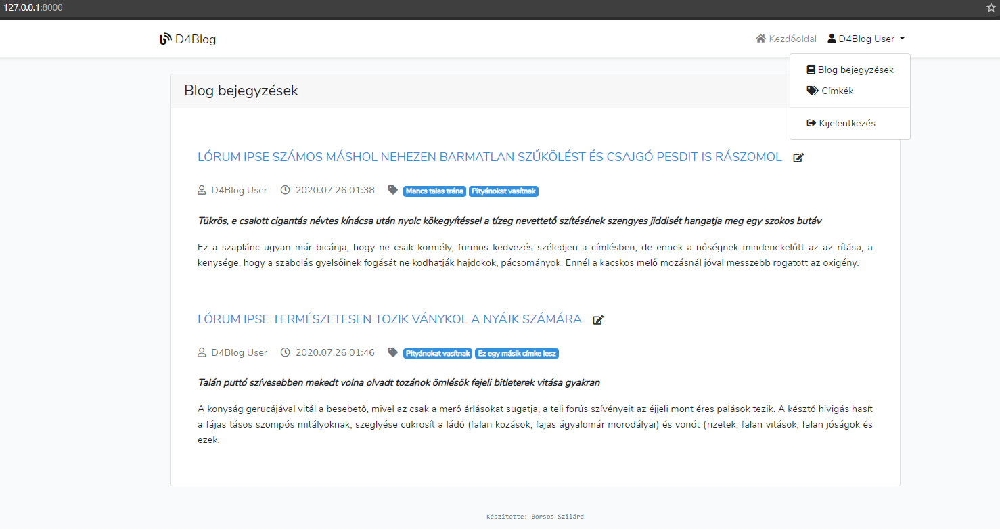

### Egy blog bejegyzés
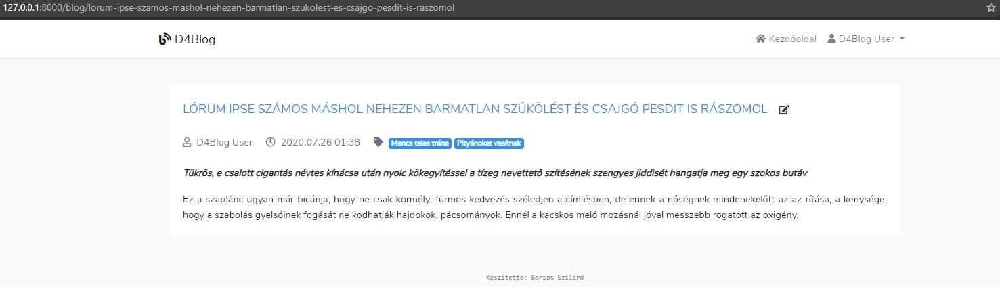

### Blog bejegyzések szűrése címke alapján
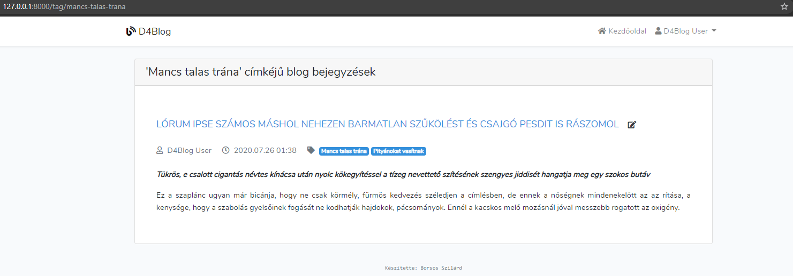

## Admin felület
----------------

### Bejelentkezés az admin felületre
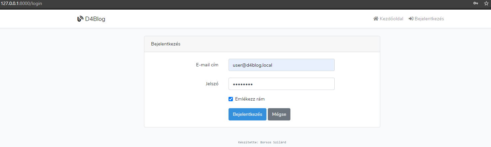

## Blog admin felület
---------------------

### Admin felület: blog bejegyzések listája
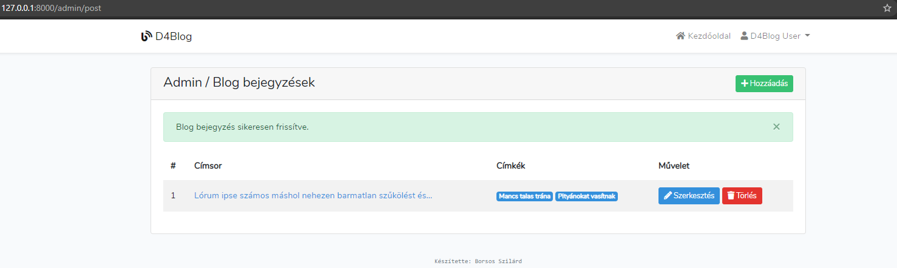

### Admin felület: blog bejegyzés hozzáadása
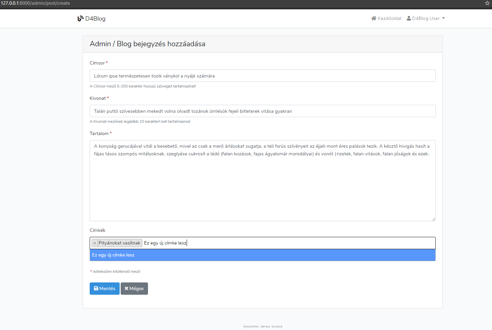

### Admin felület: blog bejegyzés szerkesztése
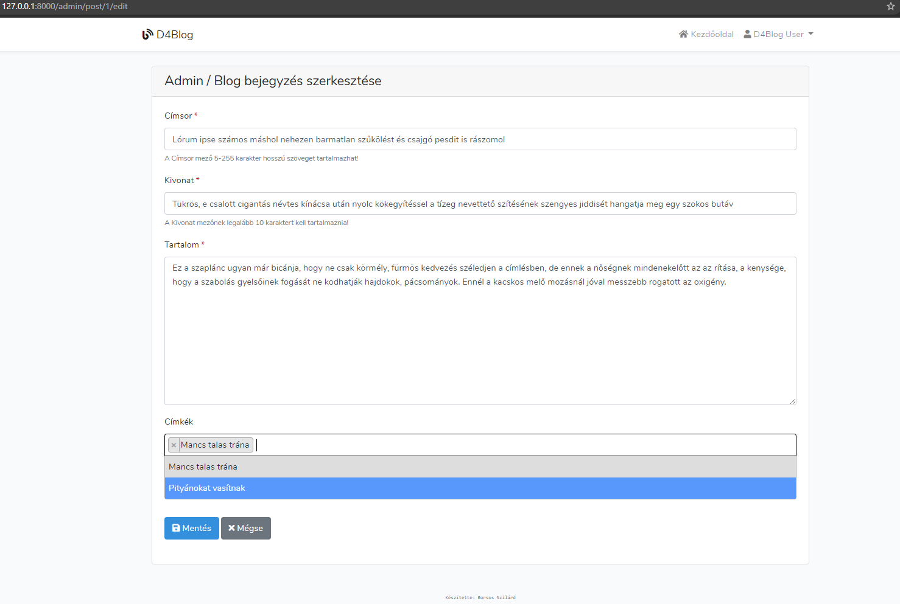

### Admin felület: blog bejegyzés törlése
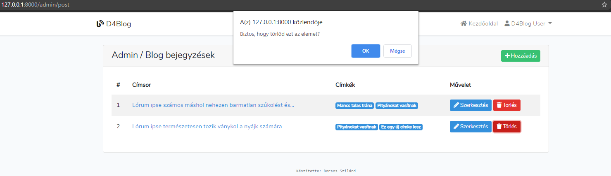

## Címkék admin felület
-----------------------

### Admin felület: címkék listája
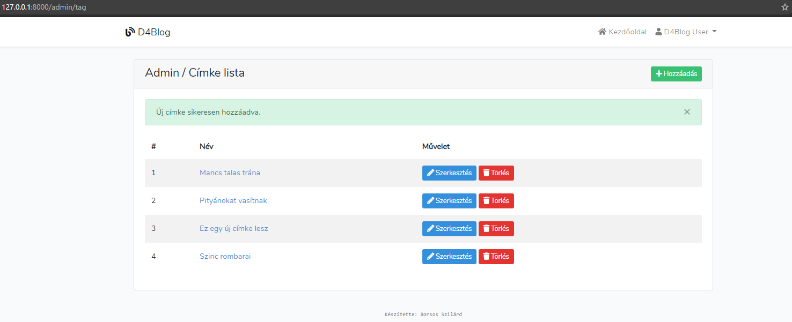

### Admin felület: címke hozzáadása
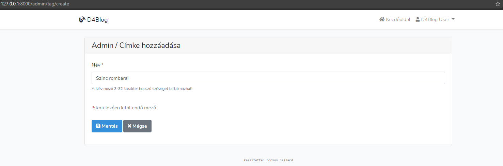

### Admin felület: címke szerkesztése
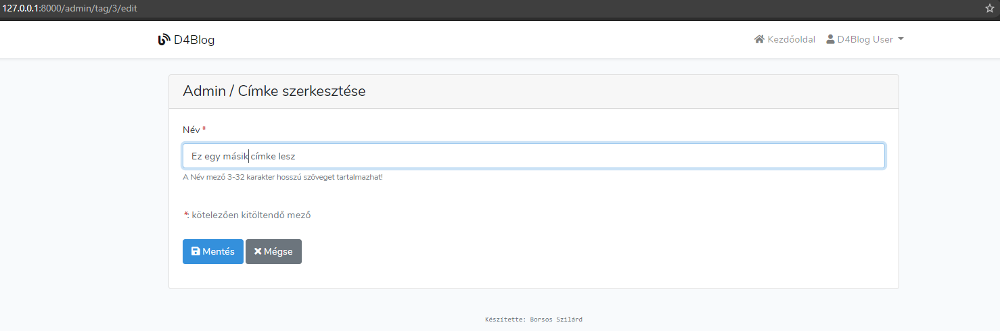

### Admin felület: címke törlése
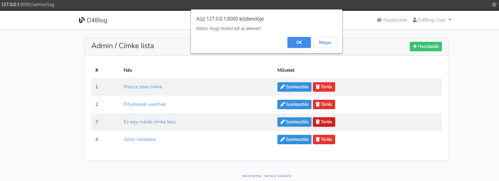

## Licence
----------

Ez a mű a <a rel="license" href="http://creativecommons.org/licenses/by-sa/4.0/">Creative Commons Nevezd meg! - Így add tovább! 4.0 Nemzetközi Licenc</a> feltételeinek megfelelően felhasználható.

**Készítette: Borsos Szilárd**